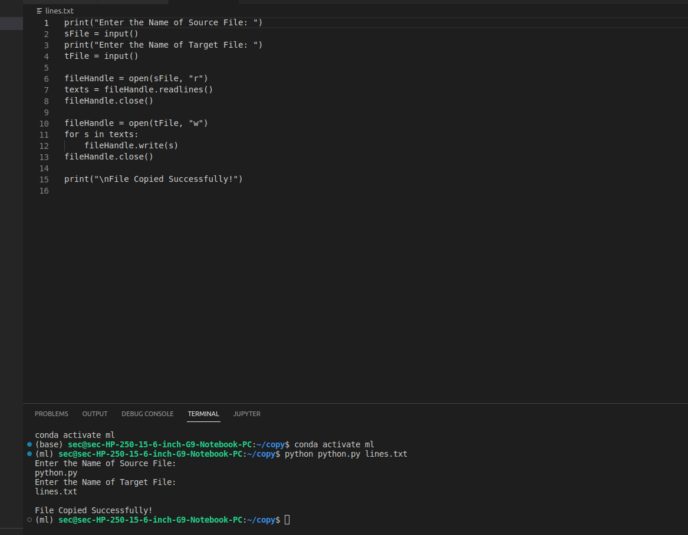

# copy-file
## AIM:
To write a python program for copying the contents from one file to another file.
## EQUIPEMENT'S REQUIRED: 
PC
Anaconda - Python 3.7
## ALGORITHM: 
### Step 1:
Create two txt file.A file which has content [lines.txt] to be copied to the empty [text.txt]file.
### Step 2: 
 Using write() function to copy the content from line.txt to empty file,text.txt.
### Step 3: 
Save and run the python program in terminal.
### Step 4:  
The text from the lines.txt file is copied to the empty file text.txt.

### Step 5: 
Then the text is shown in empty file text.txt.
### Step 6: 
Result is obtained.
## PROGRAM:
```
Program For Copying The Contents:
Developed by: Jeevitha E
RegisterNumber: 22009049

print("Enter the Name of Sou'rce File: ")
sFile = input()
print("Enter the Name of Target File: ")
tFile = input()

fileHandle = open(sFile, "r")
texts = fileHandle.readlines()
fileHandle.close()

fileHandle = open(tFile, "w")
for s in texts:
    fileHandle.write(s)
fileHandle.close()

print("\nFile Copied Successfully!")
 
 ```

### OUTPUT:




## RESULT:
Thus the program is written to copy the contents from one file to another file.